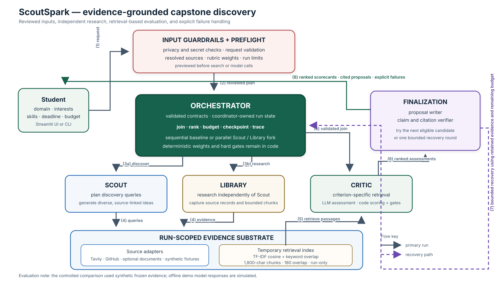

# ScoutSpark: Evidence-Grounded Capstone Idea Discovery

**AI Engineering Cohort design document | 28 September 2026**

## 1. Project motivation

I explored several capstone ideas but was not convinced by them, and I did not
have the time to spend weeks researching each one. To make that process easier,
I built a single-agent research assistant. Its early runs were promising: it
helped me explore ideas and gather useful starting points. I then recognized
that the same research bottleneck could affect many students, not just me. That
became the motivation for ScoutSpark: a capstone project that develops the idea
into a more structured, evidence-grounded workflow for discovering and assessing
project proposals.

## 2. Problem and intended user

Capstone students must turn broad interests into feasible projects by finding
real problems, evidence, data, tools, and prior work that fit their skills,
resources, team, and deadline. This research is scattered, and a promising idea
may lack data access or adequate evidence.

ScoutSpark turns a reviewed request into ranked, evidence-linked project ideas
and cited proposals when evidence and budgets permit. It surfaces constraints,
gate failures, and evidence gaps. It does not guarantee novelty, feasibility, or
a proposal for every request.

## 3. User workflow

1. The student enters a domain, interests, skills, deadline, and constraints in
   Streamlit or the CLI.
2. The student reviews the resolved source plan, rubric weights, and run limits
   in preflight. Invalid or unavailable settings fail before research calls.
3. Scout and Library perform bounded discovery work; the coordinator validates
   and joins their outputs before evaluation.
4. The student inspects weighted scorecards, evidence, citations, and hard-gate
   reasons. A displayed score finalist is not automatically eligible for a
   detailed proposal.
5. Finalization returns verified cited proposals when checks pass. If they do
   not, the result preserves the explicit failure and may include one bounded
   recovery attempt.

## 4. Architecture and data surface

Download: [editable SVG](scoutspark_architecture.svg) · [1920×1080 PNG](scoutspark_architecture.png).

**Live and evaluation data:** Live adapters are available for Tavily web search
and GitHub repository metadata; users may also provide documents. The controlled
sequential-versus-parallel comparison below used synthetic frozen source evidence
with real model calls. The fully offline demo uses synthetic sources and
deterministic simulated model responses. Those offline results verify software
behavior, not real-world research quality. A separate live run returned one
proposal, but review found weak reasoning about task-data availability, so it is
not treated as independently validated output. See
[`evals/demo_submission_2026-09-27.md`](../evals/demo_submission_2026-09-27.md),
[`evals/recovery_review_2026-09-27.md`](../evals/recovery_review_2026-09-27.md),
and [`evals/controlled_evaluation_2026-09-27.md`](../evals/controlled_evaluation_2026-09-27.md).

**AI components and RAG loop:** Scout plans discovery searches and generates
source-linked candidate ideas. Library independently plans research and prepares
evidence chunks without using Scout's candidate list. The coordinator validates
the join, checks source identity and coverage, and creates a run-scoped retrieval
index. Critic retrieves relevant passages for each candidate and asks an LLM to
assess the rubric. Code applies configured weights, deterministic tie-breaking,
and hard gates. A proposal writer drafts from the cited evidence; a separate
verifier checks claims, citations, and essential task-data dependencies. These
are bounded role-specialized workers, not open-ended autonomous loops.

**Chunking and retrieval choice:** Each run uses the configured local TF-IDF
cosine and keyword-overlap retriever. Source text is divided into 1,800-character
chunks with 180-character overlap. The index is limited to 120 chunks, 120,000
corpus characters, and 1 MB, and is retained only for the run. It uses no
semantic embedding model and no persistent vector database. This keeps evidence
provenance local and bounded. Semantic embeddings are deferred until held-out
retrieval evaluation shows that this baseline misses relevant evidence. Exact
limits are in [`config/retrieval.json`](../config/retrieval.json); the runtime
retrieval behavior is documented in
[`docs/orchestration.md`](orchestration.md).

**Privacy and trust boundaries:** Deterministic checks block recognizable
credentials and warn about possible email addresses or phone numbers. Uploaded
text is scanned after extraction; model inputs and outputs are scanned at the
client boundary; upload snippets and chunk text are redacted from exported
results. Traces retain metadata and usage rather than matched text. User and
retrieved text remain untrusted input; code owns provider permissions, budgets,
weights, and ranking. These checks are limited pattern-based safeguards: they
can miss obfuscated secrets or other sensitive content, and prompt instructions
do not guarantee that a live model will resist every injection. Warnings are not
a privacy guarantee. See
[`docs/guardrails.md`](guardrails.md).

Pydantic contracts validate stage boundaries. Streamlit and the CLI share the
same application and preflight path. The coordinator owns run state, budgets,
retries, stage transitions, ranking, checkpoints, and final selection.

## 5. Failure handling and recovery

| Failure | System behavior | Verification / limit |
| --- | --- | --- |
| Invalid request or unavailable required provider | Preflight returns an actionable error before research starts. | Covered by configuration and UI checks. |
| Malformed model output | Typed `invalid_output` failure; schema-invalid output is not accepted. | Retry policy does not retry malformed output. |
| Required Scout or Library branch fails | The required run fails; in parallel mode the sibling is cancelled and drained. | Blocking provider calls may finish within socket timeout and remain charged. |
| Insufficient source coverage or empty retrieval | Critic is skipped and the run reports insufficient coverage. | Evidence rules and minimum coverage are not relaxed to fill a slot. |
| Draft or verification fails | Record the failed candidate and try the next eligible candidate. | One correction and recheck is allowed; the verifier can still make semantic errors. |
| No proposal survives | One bounded recovery round may reuse evidence, make up to two searches, and evaluate up to three replacements under the same budget. | Exhaustion remains a failure; recovery does not guarantee a proposal. |
| Interruption or resume | Optional CLI checkpoints reuse valid completed stages and rerun missing or invalid work. | Resume requires the same run inputs and configuration; Streamlit does not expose resume controls. |

Reliability tests cover typed failures, branch cancellation, retries, checkpoint
resume, replay without model calls, and scheduling equivalence under fixed model
responses. These deterministic tests establish software invariants, not live
model quality. The verifier's small component evaluations still show false
rejections and missed unsupported claims; its limitations are reported in
[`evals/reliability-2026-09-27.md`](../evals/reliability-2026-09-27.md).

## 6. Evaluation and approach comparison

### Controlled scheduling comparison

The controlled comparison used the same three synthetic frozen cases, prepared
requests, model, rubric, and limits. The only intended change was sequential
versus concurrent Scout/Library execution. This is an orchestration ablation,
**not** a single-agent or vanilla-RAG comparison.

| Measure | Sequential | Parallel |
| --- | ---: | ---: |
| Detailed proposals / requested | 1 / 9 | 2 / 9 |
| Cases meeting requested count | 0 / 3 | 0 / 3 |
| Required source-type coverage | 3 / 3 | 3 / 3 |
| Citation integrity | 1 pass; 2 not evaluated | 1 pass; 2 not evaluated |
| Elapsed time | 376.0 s | 353.6 s |
| Model tokens / estimated cost | 181,291 / $0.04665 | 172,152 / $0.04486 |

Each mode ran once and produced different proposals. Parallel latency was about
6% lower and estimated cost about 4% lower, but those descriptive results do not
prove a general improvement. Yield remained low, and missing proposals were not
counted as citation passes. Later runs used changed verifier and recovery
behavior and produced different results; they are reported separately in the
linked recovery evaluation rather than combined into this baseline.

An offline deterministic test confirms equivalent results when both scheduling
modes receive identical fixed model responses. The application tracks proposal
yield, source coverage, citation integrity, hard-gate outcomes, latency, token
usage, and estimated model cost. Provider charges may differ from the app's cost
estimate. A blind LLM judge reviewed three available proposals (n=3): usefulness
3.00, specificity 3.00, evidence sufficiency 2.00, feasibility 3.33, and
actionability 3.00 out of 5. Human ratings are pending; no human agreement
measure exists. The judge scores are not ground truth.

### Design trade-offs

| Choice | Current approach | Benefit | Trade-off / evidence still needed |
| --- | --- | --- | --- |
| Retrieval | In-memory TF-IDF plus keywords | Local, bounded index with source provenance. | May miss paraphrased evidence; compare embeddings on held-out cases before changing. |
| Worker scheduling | Sequential default; parallel option | Parallelism can overlap Scout and Library research. | Single runs are inconclusive; repeat on a larger frozen set before changing the default. |
| Orchestration framework | Custom coordinator, Pydantic contracts, role prompts, one recovery round | State, budgets, and failures stay inspectable and testable. | Measure against a single-agent/plain-RAG baseline; current results do not justify a heavier framework. |

The evaluation is preliminary: three synthetic frozen cases, one run per
scheduling mode, and three LLM-judged proposals. The course target of a larger
held-out set, repeated A/B runs, and representative independent human review is
not yet met. The target is at least one verified proposal per adequately covered
case without relaxing evidence rules. See
[`evals/demo_submission_2026-09-27.md`](../evals/demo_submission_2026-09-27.md)
for reproduction details and the dated measurements.

## 7. Framework justification and next evaluation steps

Role separation makes evidence and failures inspectable and permits isolated
testing. Pydantic validates contracts; the OpenAI SDK provides model calls;
Streamlit provides the optional local UI. Pydantic AI, LangGraph, and smolagents
were not added because this bounded workflow and single recovery round do not
yet demonstrate a need for their abstractions. This remains a provisional
complexity choice until a single-agent/plain-RAG baseline is measured.

The next evaluation work is to complete independent human scoring of the saved
proposals, expand held-out coverage, repeat the scheduling comparison enough to
measure variance, and compare against a single-agent/plain-RAG baseline. Verifier
accuracy and retrieval quality need larger held-out and adversarial reviews.
Dynamic criteria and user-triggered feedback rounds remain future work.
