# ScoutSpark: Evidence-Grounded Capstone Idea Discovery

**AI Engineering Cohort design document | 27 September 2026**

## 1. Problem statement

Capstone students must turn broad interests into feasible projects by finding
real problems, evidence, data, tools, and prior work that fit their skills,
resources, team, and deadline. This scattered research takes time, and a
promising idea may lack data access or adequate evidence.

ScoutSpark turns a reviewed request into ranked, evidence-linked project ideas
and a cited proposal when support permits. It surfaces constraints and evidence
gaps; it does not guarantee novelty or feasibility when sources or budget are
insufficient.

## 2. Architecture and data surface

The data surface is actively queried: Tavily web search, GitHub repository
metadata, and optional user documents. Frozen records/passages are synthetic
test data. Source records retain provenance; bounded chunks carry evidence.
Each run creates an in-memory TF-IDF/keyword index, with no semantic embedding
model or persistent vector database.

**AI components and RAG loop:** Scout and Library are separate LLM-backed
workers: Scout plans discovery searches and generates ideas; Library independently
researches sources and prepares evidence chunks. The orchestrator joins their
results. For each candidate, Critic retrieves relevant Library passages and asks
the judge to assess the rubric; code computes weighted scores and hard gates.
The proposal writer drafts from cited evidence and a verifier checks support.
Finalization tries the next candidate after failure, then allows one bounded
recovery round. These are role-specialized workers, not open-ended autonomous
loops.

```mermaid
flowchart LR
    User["Student request"] --> Setup["Reviewed configuration<br/>Preflight + budgets"]
    Setup --> Orchestrator["Orchestrator<br/>join · validate · coordinate"]

    Orchestrator --> Scout["Scout agent<br/>plan queries · generate ideas"]
    Orchestrator --> Library["Library agent<br/>plan queries · gather evidence"]
    Scout --> Adapters["Source adapters"]
    Library --> Adapters
    Adapters --> Sources["Tavily · GitHub<br/>optional uploads · synthetic fixtures"]
    Sources --> Scout
    Sources --> Library

    Scout --> Candidates["Candidate ideas"]
    Scout --> Join
    Library --> Join["Join source receipts<br/>validate identity and coverage"]
    Join --> Index["Run-scoped in-memory index<br/>TF-IDF + keyword overlap"]
    Candidates --> Critic["Critic agent<br/>retrieve · judge · score + gates"]
    Critic -- "candidate / criterion query" --> Index
    Index -- "top-k evidence passages" --> Critic
    Critic --> Finalize["Proposal writer<br/>draft from cited evidence"]
    Finalize --> Verify["Evidence / citation verifier"]
    Verify --> Results["Ranked scorecards<br/>+ verified proposals"]
    Verify -. "if none survive" .-> Recovery["One bounded recovery round"]
    Recovery -. "replacement candidates" .-> Critic

    Model["LLM client + role prompts"] -. "used by Scout, Library, Critic, writer, verifier" .-> Scout
    Model -.-> Library
    Model -.-> Critic
    Model -.-> Finalize
    Model -.-> Verify
    Contracts["Pydantic contracts"] -. "validated stage boundaries" .-> Orchestrator
    Ops["Guardrails · shared budgets · tracing / checkpoints"] -. "cross-cutting controls" .-> Orchestrator

    classDef agent fill:#eee8ff,stroke:#7453a6,color:#211238,stroke-width:2px
    classDef rag fill:#e0f4f2,stroke:#2b8178,color:#123b37,stroke-width:2px
    classDef source fill:#fff4de,stroke:#b57a24,color:#50330f
    classDef control fill:#f1f3f5,stroke:#58616b,color:#222
    classDef output fill:#e8f5e9,stroke:#3c7d48,color:#17351b
    class Scout,Library,Critic,Finalize,Verify agent
    class Index rag
    class Adapters,Sources source
    class Setup,Orchestrator,Model,Contracts,Ops control
    class Results output
```

Pydantic contracts validate each stage boundary. Streamlit and the CLI share the
same application and preflight path.

## 3. Evaluation and approach comparison

The controlled comparison used the same three synthetic frozen cases, prepared
requests, model, and limits. Only scheduling changed: sequential versus
concurrent Scout/Library execution. This is an orchestration ablation, **not**
a comparison with a single-agent or vanilla-RAG architecture.

| Measure | Sequential | Parallel |
| --- | ---: | ---: |
| Detailed proposals / requested | 1 / 9 | 2 / 9 |
| Cases meeting requested count | 0 / 3 | 0 / 3 |
| Required source-type coverage | 3 / 3 | 3 / 3 |
| Citation integrity | 1 pass; 2 not evaluated | 1 pass; 2 not evaluated |
| Elapsed time | 376.0 s | 353.6 s |
| Model tokens / estimated cost | 181,291 / $0.04665 | 172,152 / $0.04486 |

Each mode was run once and produced different proposals. Parallel latency was
about 6% lower and estimated cost about 4% lower, but these descriptive results
do not prove a general improvement; yield stayed low. Missing proposals were not
counted as citation passes. An offline deterministic test confirms equivalent
results when both modes receive identical fixed model responses.

Metrics are per-case proposal yield, source coverage, citation integrity,
hard-gate outcomes, latency, and provider/model cost. Target: at least one
verified proposal per adequately covered case, without relaxing evidence rules.
A blind LLM judge rated three proposals (n=3): usefulness 3.00, specificity
3.00, evidence 2.00, feasibility 3.33, and actionability 3.00 out of 5. Human
ratings are pending; this small sample is not general quality evidence. Details:
`evals/demo_submission_2026-09-27.md`.

## 4. Design and framework justification

Role separation makes each stage's evidence and failures inspectable and
independently testable. Parallelism overlaps independent searches, but has not
shown a proposal-quality advantage; sequential mode remains the CLI default.
Pydantic validates contracts, and the OpenAI SDK provides model calls. Pydantic
AI, LangGraph, and smolagents were not added because this bounded workflow and
single recovery round do not yet demonstrate a need for framework abstractions.
Streamlit is the optional UI. Semantic embeddings remain deferred until held-out
retrieval tests expose misses from the local TF-IDF/keyword baseline. The
complexity choice is provisional: a true single-agent/plain-RAG baseline is
still needed to show whether it improves end-to-end quality or cost.
